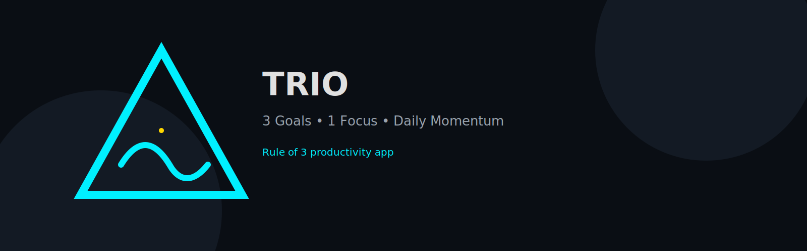
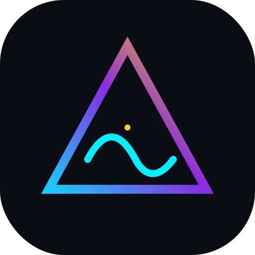
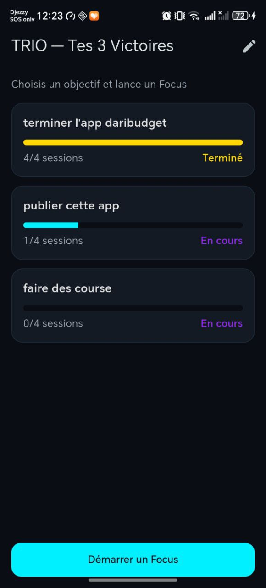
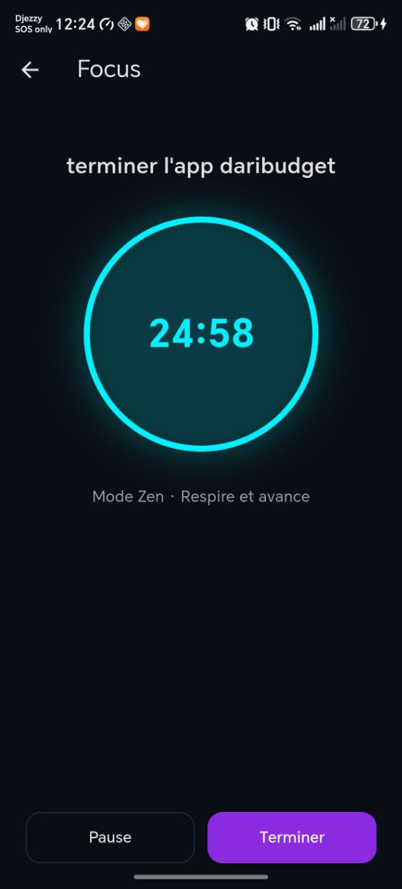
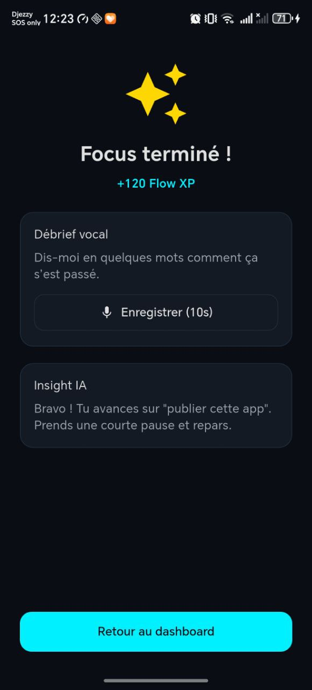

# TRIO

<p align="center">
  
</p>

<p align="center">
  
</p>

<p align="center">
  <strong>3 Goals • 1 Focus • Daily Momentum</strong>
</p>

<p align="center">
  
  
  
</p>

**TRIO** is a minimalist productivity app built around the **Rule of 3**: pick **three key objectives** each day, focus on one at a time, and finish with a rewarding reflection loop.

---

## ✨ Core Concept
Every day, you define **three wins**. Each focus session (25 minutes by default) is attached to one of those wins. When you finish, TRIO rewards you with a micro-celebration and an AI-powered reflection.

---

## ✅ MVP Features (Current)
- **Dashboard of 3 daily goals**
- **Focus session with real countdown timer**
- **Reward screen with confetti animation**
- **Voice reflection (speech-to-text)**
- **Local persistence (SharedPreferences)**

---

## 🧱 Tech Stack
- **Flutter (Dart)**
- **Provider** for state management
- **SharedPreferences** for local storage
- **Confetti** for animations
- **Speech-to-text** for reflections

---

## 📱 Screens
1. **Dashboard** → Set your 3 objectives
2. **Focus** → 25 min timer, zero distraction
3. **Reward** → XP + reflection + insight

<p align="center">
  
  
  
</p>

---

## 🧭 Roadmap
- [ ] AI summary + insight from reflection
- [ ] Daily streaks & progress history
- [ ] Custom timer durations
- [ ] Haptics + focus sounds
- [ ] Theme customization (Dark / Light)

---

## 🚀 Run Locally
```bash
flutter pub get
flutter run
```

---

## 🧩 Project Structure
```
lib/
├── main.dart
├── models/
│   ├── goal.dart
│   └── trio_state.dart
├── screens/
│   ├── dashboard_screen.dart
│   ├── focus_screen.dart
│   └── reward_screen.dart
└── widgets/
    └── goal_card.dart
```

---

## 📄 License
MIT (to be added)

---

Built with ❤️ by Team TRIO
